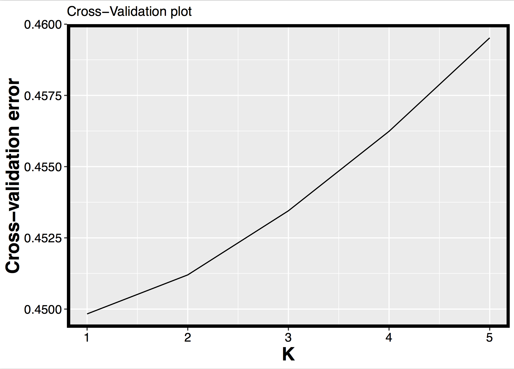

# RADseq-softwares
The goal of this project is to Downloading programs and packages usefull for RADseq studies
to setup their computers for RADseq genomic analysis.

## Install [VCFTOOLS](http://vcftools.sourceforge.net/)
VCFtools is a program package designed for working with VCF files, such as those generated by [STACKS](http://catchenlab.life.illinois.edu/stacks/).

## Install [PLINK](http://zzz.bwh.harvard.edu/plink/download.shtml)
PLINK is a free, open-source whole genome association analysis toolset, designed to perform with tfam and tped files that are easily converted from vcftools via the ***plink-tped*** following command:
```{r, engine = 'bash', eval = FALSE}
vcftools --vcf nameofyourfile.vcf --plink-tped --out nameofyourfile
done
```

## Install [ADMIXTURE](http://software.genetics.ucla.edu/admixture/)
ADMIXTURE is a software tool for maximum likelihood estimation of individual ancestries from multilocus SNP genotype datasets. It uses the same statistical model as STRUCTURE but calculates estimates much more rapidly using a fast numerical optimization algorithm.
To use ADMIXTURE, you need to transfor your file vcf file into a bed format via plink by typing the ***make-bed*** command available in PLINK:
```{r, engine = 'bash', eval = FALSE}
plink --tfam nameofyourfile.tfam --tped nameofyourfile.tped --make-bed --out nameofyourfile
done
```
### Run Admixture
Go into the folder where your bed file is. Add the path of this file in your terminal by typing:

for K in 1 2 3 4 5; do admixture --cv=10 -B2000 -j8 nameofyourfile.bed $K | tee log${K}.out; done

### Collect the cross validation information obtained from the log files
grep -h CV log*.out>cross_validation.txt

### Take the right order for individual id using the tfam file
cut -f 1 nameofyourfile.tfam > id_admixture.txt

### Remove last features
rm(list=ls())
ls()

### Use R to analyze the results 
First, download librairies:
```{r}
library(stringr)
library(ggplot2)
library(dplyr)
```
Download the cross-validation results you have previously created via bash command.
```{r}
cv <- read.table("cross_validation.txt")
```
Then, add a K-cluster column indicating the number of K you test and select only two columns of interest, CV and K.
```{r}
cv$K <- c(1,2,3,4,5)  
CV <- select(cv, V4,K)
```
Rename your two columns CV and K-cluster
```{r}
colnames(CV) <- c("CV","K")
```
Do a graph showing the cross validation results (the optimal number of clusters has the lowest cross validation error)
```{r}
graph_title="Cross-Validation plot"
x_title="K"
y_title="Cross-validation error"
graph_1<-ggplot(CV,aes(x=K,y=CV))
graph_1+geom_line()+scale_x_continuous(breaks=c(1,2,3,4,5))+
  labs(title=graph_title)+
  labs(x=x_title)+
  labs(y=y_title)+
  theme(axis.text.x=element_text(colour="black"))+
  theme(legend.title=element_blank())+
  theme(axis.text.y=element_text(colour="black",size=12))+
  theme(axis.text.x=element_text(colour="black",size=12))+
  theme(panel.border = element_rect(colour="black", fill=NA, size=3),
        axis.title=element_text(size=18,colour="black",family="Helvetica",face="bold"))
```
Save the graph
```{r}
ggsave("Admixture_cross-validation.pdf",width=7,height=5,dpi=600)
dev.off()
```

